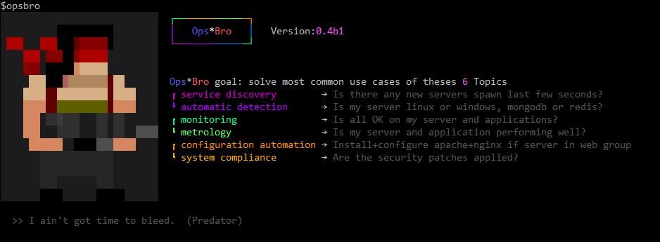
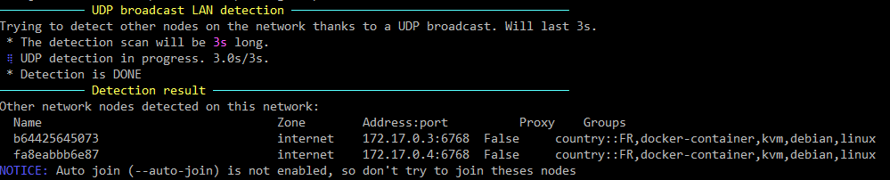
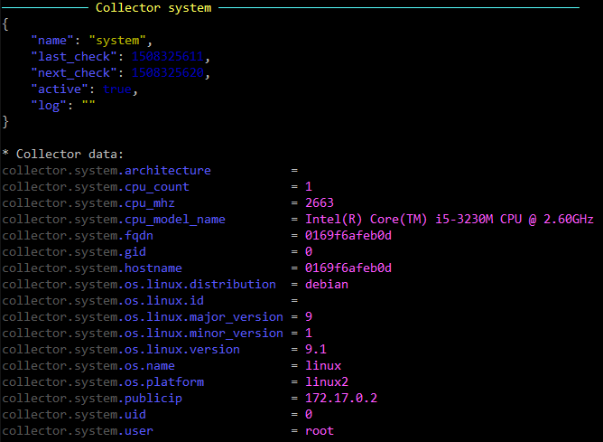
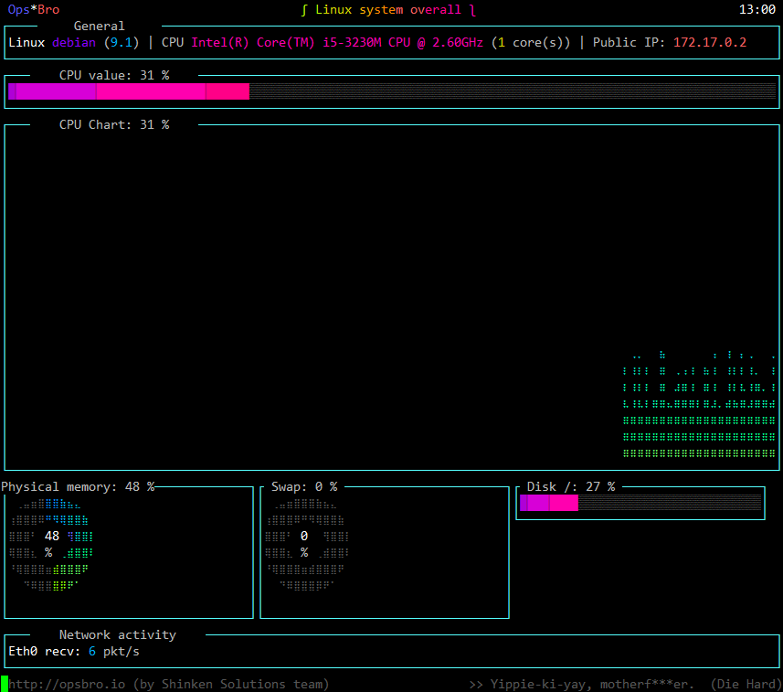
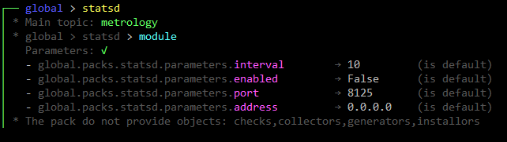
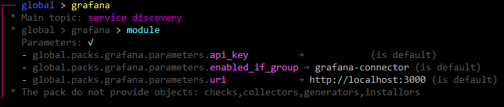
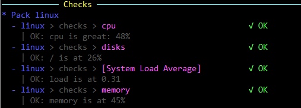

## **OpsBro**

All the configuration / deployment is model based (aka into **packs**)

## Installation

#### Prerequites
You will need:

  * python (2.6 or 2.7)

#### Installation

Just launch:

    python setup.py install

Note: On the main linux distributions, it will automatically install its dependencies from the package manager (apt/yum):
  * debian
  * centos
  * redhat
  * ubuntu

On the others distributions (OpenSuse, Alpine, etc), depedencies will be take from pypi.

## Start OpsBro daemon
You can start opsbro as a daemon with:
 
    service opsbro start

## Stop OpsBro daemon
Just launch:
  
    service opsbro stop

## Display OpsBro information
Just launch:

    opsbro agent info

You will have several information about the current opsbro agent state:

## Automatic detection (os, apps, location, ...)

Detectors are rules that are executed by the agent to detect your server properties like

 * OS (linux, redhat, centos, debian, windows, ...)
 * Applications (mongodb, redis, mysql, apache, ...)
 * Location (country, city, GPS Lat/Long)

You should declare a json object like:

    detector:
        apply_if: "grep_file('centos', '/etc/redhat-release')"
        add_groups:
            - linux
            - centos
        interval: 3600s

 * If there is the string centos in the file /etc/redhat-release
 * Then add the group "linux" and centos" to the local agent
 * Execute every 3600 seconds

## Service discovery

You can use OpsBro on one or more server in an independant way, but it's full power is when you are linking them together in a cluster.

#### Agent cluster membership

##### Add your local node to the node cluster

First you need to install and launch the node in another server.

Then in this other server you can launch:
  
    opsbro gossip join  OTHER-IP

##### Auto discover LAN nodes (UDP broadcast detection)

If your nodes are on the same LAN, you can use the UDP auto-detection to list others nodes on your network. I will send an UDP broadcast packet that other nodes will answer.

NOTE: if you are using an encryption key (recommanded) then you must already have set it. If not, the other node won't answer to your query.

    opsbro gossip detect --auto-join

##### List your opsbro cluster members
You can list the cluster members on all nodes with :

    opsbro  gossip members

## Metrology: collect your server metrics (cpu, kernel, databases metrics, etc)

Collectors are code executed by the agent to grok and store local os or application metrics. 

You can list available collectors with the command:

    opsbro collectors list
 
 

## How to see collected data? (metrology)

The opsbro agent is by default getting lot of metrology data from your OS and applications. It's done by "collctors" objets. You can easily list them and look at the collected data by launching:

    opsbro collectors show system

For example for the system collector:

## Show dashboards

Packs can provide dashboards to show collected data. Here is an example of the standard linux dashboard:

    opsbro dashboards show linux

To list available dashboards:
   opsbro dashboards list

## Export and store your application telemetry into the agent metric system

### Real time application performance metrics

The statsd protocol is a great way to extract performance statistics from your application into your monitoring system. You application will extract small timing metrics (like function execution time) and send it in a non blocking way (in UDP).

The statsd daemon part will agregate counters for 10s and will then export the min/max/average/99thpercentile to a graphite server so you can store and graph them.

In order to enable the statsd listener, you must define enable it your configuration.

You can show it with the command:

    opsbro packs show

And search for the statsd pack:

All you need is to change the enabled parameter of the statsd pack.

You can get a description about the parameter first with:

    opsbro packs parameters get global.statsd.enabled

And you can edit it with:

    opsbro packs parameters set global.statsd.enabled true

Then restart our agent:

    service opsbro restart

## Grafana: view your node metrology data into Grafana

You can see your metrology data into Grafana. All you need to do is to enable the grafana pack for this.

You will need:
  * set a grafana API key
  * change the grafana URI if not on the same server as your agent
  * add the group **grafana-connector** to your agent so it will start the grafana module

    opsbro packs parameters set  global.grafana.api_key  'YOUR-API-KEY'
    opsbro packs parameters set  global.grafana.uri      'http://YOUR-GRAFANA-SERVER:3000'

And to add the group **grafana-connector** to your agent:

    opsbro agent parameters add groups grafana-connector

And voila, you will see a new data-source in your grafana.

## Monitoring

You can execute checks on your agent by two means:
  * Use the collectors data and evaluate check rule on it
  * Execute a nagios-like plugin

### Common check parameters for evaluated and nagios plugins based checks

Some parameters are common on the two check types you can defined.

  * interval: how much seconds the checks will be scheduled
  * if_group: if present, will declare and execute the check only if the agent group is present

### Evaluate check rule on collectors data

Evaluated check will use collectors data and should be defined with:
  * ok_output: python expression that create a string that will be shown to the user if the state is OK
  * critical_if: python expression that try to detect a CRITICAL state
  * critical_output: python expression that create a string that will be shown to the user if the state is CRITICAL
  * warning_if: python expression that try to detect WARNING state
  * warning_output: python expression that create a string that will be shown to the user if the state is WARNING
  * interval: launch the check every X seconds
  
The evaluation is done like this:
  * if the critical expression is True => CRITICAL
  * else if warning expression is True => WARNING
  * else go OK
  
For example here is a memory check on a linux server:

    check:
        if_group: linux

        ok_output: "'OK: memory is at %d%%' % {{collector.memory.phys_used}}"

        critical_if: "{{collector.memory.phys_used}} > {{parameters.memory_critical}}"
        critical_output: "'CRITICAL: memory is at %d%%' % {{collectors.memory.phys_used}}"

        warning_if: "{{collector.memory.phys_used}} > {{parameters.threshold.memory_warning}}"
        warning_output:  "'WARNING: memory is at %d%%' % {{collector.memory.phys_used}}"

        interval: "30s"
            
You can have the result with the command:

    opsbro monitoring state

### Use Nagios plugins

Nagios based checks will use Nagios plugins and run them. Use them if you don't have access to the information you need in the collectors.

The parameter for this is:
  * script: the command line to execute your plugin
  
  Here is an example 
  
    check:
        if_group: linux
        script:   "/var/lib64/nagios/check_mailq -w 1 -c 2"
        interval: 60s

## Notify check/node state change with emails

You can be notified about check state changed with handlers. Currently 2 are managed:

 * email
 * slack

### Email handlers

You can get a mail each time a check did change state. All is managed by the mail pack. You can enable it with:

    opsbro packs parameters set global.mail.enabled true

## Notify check & node state change into slack

You can be notified about check state changed with handlers:

  * token: your slack token. Get one at https://api.slack.com/custom-integrations/legacy-tokens
  * channel: on which channel should the alerts go. If the channel is not existing, it will try to create one

    opsbro packs parameters set global.slack.enabled  true
    opsbro packs parameters set global.slack.token    'SLACK-TOKEN'

## Export your nodes and check states into Shinken or Nagios

You can export all your nodes informations (new, deleted or change node) into your Shinken installation. It will automatically:
  * create new host when you start a new node
  * change the host configuration (host templates) when a new group is add/removed on your agent
  * remove your host when you delete your agent (by terminating your Cloud instance for example)

All is managed into the shinken pack.

For Nagios:

    opsbro  packs parameters set local.shinken.enabled               true
    opsbro  packs parameters set local.shinken.cfg_path              /usr/local/nagios/etc/objects/agent
    opsbro  packs parameters set local.shinken.external_command_file /usr/local/nagios/var/rw/nagios.cmd
    opsbro  packs parameters set local.shinken.reload_command        "/etc/init.d/nagios reload"
    opsbro  packs parameters set local.shinken.monitoring_tool       nagios

Note that you must create the /usr/local/nagios/etc/objects/agent and declare it in the nagios.cfg file.

For Shinken:

    opsbro  packs parameters set local.shinken.enabled               true
    opsbro  packs parameters set local.shinken.cfg_path              /etc/shinken/agent
    opsbro  packs parameters set local.shinken.external_command_file /var/lib/shinken/shinken.cmd
    opsbro  packs parameters set local.shinken.reload_command        "/etc/init.d/shinken reload"
    opsbro  packs parameters set local.shinken.monitoring_tool       shinken

For Shinken, note that the external unix pipe (/var/lib/shinken/shinken.cmd) is available with the receiver module [named-pipe](http://shinken.io/package/named-pipe).

## DNS: Access your nodes informations by DNS

If you enable the DNS interface for your agent, it will start an internal DNS server that will answer to queries. So your applications will be able to easily exchange with the valid node that is still alive or launched.

All you need is to set your agent to the dns-listener group to start the DNS listener module.

    opsbro agent parameters add groups dns-listener

Then you can query your agent in DNS:
    dig -p 6766  @127.0.0.1 linux.group.local.opsbro
    192.168.56.103
    192.168.56.105

It list all available node with the "group" linux.

## Is there an UI available?

To see your metrology data, look at the grafana module.

To see the nodes & metrology states, an UI is currently in progress. Will be not Open source but will be free of use at the opsbro.io website.
Please contact me (naparuba _AT_ gmail.com is you are interested to test it in Beta phase).

