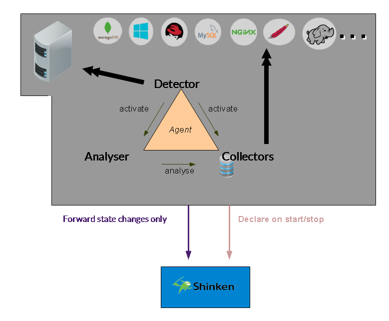
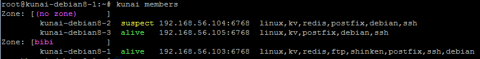
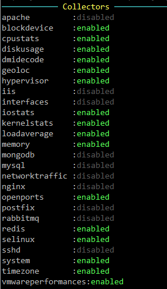

This is a first release of the opsbro project about a service discovery / monitoring / light cfg management / command execution tool.

## **OpsBro**: monitoring and service discovery

## Installation

#### Prerequites
You will need:

  * python 2.6 or 2.7 (python 3 is not managed currently)

It will automatically install:
  * python-leveldb
  * python-requests
  * python-jinja2 
  * python-cherrypy3

To monitor linux:
  * sysstat

To monitor mongodb server:
  * python-pymongo

#### Installation

Just launch:

    python setup.py install

## Run your daemon, and join the opsbro cluster

#### Start OpsBro

You can start opsbro as a daemon with:
 
    /etc/init.d/opsbro start

You can also launch it in foreground:

    opsbro agent start

#### Stop opsbro daemon
Just launch:
  
    opsbro agent stop

Or use the init.d script:

    /etc/init.d/opsbro stop

#### Display opsbro information
Just launch:

    opsbro agent info

You will have several information about the current opsbro agent state:

 
 

#### Agent cluster membership

##### Add your local node to the node cluster

First you need to install and launch the node in another server.

Then in this other server you can launch:
  
    opsbro gossip join  OTHER-IP

##### Auto discover LAN nodes (UDP broadcast detection)

If your nodes are on the same LAN, you can use the UDP auto-detection to list others nodes on your network. I will send an UDP broadcast packet that other nodes will answer.

NOTE: if you are using an encryption key (recommanded) then you must already have set it. If not, the other node won't answer to your query.

    opsbro gossip detect

If the other nodes are present, they will be list by the command.

If you want to auto-join the other node cluster, then you can use the --auto-join parameter:

    opsbro gossip detect --auto-join

It will try to join nodes based on:
 * first try to a proxy node if present
 * if no proxy node is present, then use the fist other node

##### List your opsbro cluster members
You can list the cluster members on all nodes with :

    opsbro  gossip members

 

And you will see the new node on the UI if you enable it

## Discover your server (os, apps, location, ...)

Detectors are rules that are executed by the agent to detect your server properties like

 * OS (linux, redhat, centos, debian, windows, ...)
 * Applications (mongodb, redis, mysql, apache, ...)
 * Location (city, GPS Lat/Long)

You should declare a json object like:

    detector:
        interval: 10s
        apply_if: "grep('centos', '/etc/redhat-release')"
        groups: ["linux", "centos"]

 * Execute every 10 seconds
 * If there is the strong centos in the file /etc/redhat-release
 * Then add the group "linux" and centos" to the local agent

## Collect your server metrics (cpu, kernel, databases metrics, etc)

Collectors are code executed by the agent to grok and store local os or application metrics. 

You can list available collectors with the command:

    opsbro collectors list
 
 
 

 * enabled: it's running well
 * disabled: it's missing a librairy for running

## Execute checks

You can execute checks on your agent by two means:
  * Use the collectors data and evaluate check rule on it
  * Execute a nagios-like plugin

### Common check parameters for evaluated and nagios plugins based checks

Some parameters are common on the two check types you can defined.

  * interval: how much seconds the checks will be scheduled
  * if_group: if present, will declare and execute the check only if the agent group is present

### Evaluate check rule on collectors data

Evaluated check will use collectors data and should be defined with:
  * ok_output: python expression that create a string that will be shown to the user if the state is OK
  * critical_if: python expression that try to detect a CRITICAL state
  * critical_output: python expression that create a string that will be shown to the user if the state is CRITICAL
  * warning_if: python expression that try to detect WARNING state
  * warning_output: python expression that create a string that will be shown to the user if the state is WARNING
  * thresholds: [optionnal] you can set here dict of thresholds you will access from your check rule by "configuration.thresholds.XXX"
  
The evaluation is done like this:
  * if the critical expression is True => go CRITICAL
  * else if warning expression is True => go WARNING
  * else go OK
  
For example here is a cpu check on a linux server:

    check:
        interval:          10s
        if_group:          linux
            
        ok_output:         "'OK: cpu is great: %s%%' % (100-{collector.cpustats.cpuall.%idle})"
            
        critical_if:       "{collector.cpustats.cpuall.%idle} < {configuration.thresholds.cpuidle.critical}"
        critical_output:   "'Critical: cpu is too high: %s%%' % (100-{collector.cpustats.cpuall.%idle})"

        warning_if:        "{collector.cpustats.cpuall.%idle} < {configuration.thresholds.cpuidle.warning}"
        warning_output:    "'Warning: cpu is very high: %s%%' % (100-{collector.cpustats.cpuall.%idle})"
            
        thresholds :
               cpuidle :
                    warning: 5
                    critical: 1

### Use Nagios plugins

Nagios based checks will use Nagios plugins and run them. Use them if you don't have access to the information you need in the collectors.

The parameter for this is:
  * script: the command line to execute your plugin
  
  Here is an example 
  
    check:
        if_group: linux
        script:   "$nagiosplugins$/check_mailq -w $mailq.warning$ -c $mailq.critical$"
        interval: 60s
    
        mailq:
           warning: 1
           critical: 2

NOTE: the $$ evaluation is not matching the previous checks, we will fix it in a future version but it will break the current version configuration.

## Notify check/node state change with emails

You can be notified about check state changed with handlers. currently 2 are managed: email & slack

You must define it in your local configuration:

    handler:
        type: mail
        severities:
            - ok
            - warning
            - critical
            - unknown
        contacts:
            - "admin@mydomain.com"
        addr_from: "opsbro@mydomain.com"
        smtp_server: localhost
        subject_template: "email.subject.tpl"
        text_template: "email.text.tpl"

  * type: email
  * severities: raise this handler only for this new states
  * contacts: who notifies
  * addr_from: from address to set your email from
  * smtp_server: which SMTP server to end your notification
  * subject_template: jinja2 template for the email subject, from the directory /templates
  * text_template: jinja2 template for the email content, from the directory /templates

Then your handler must be registered into your checks, in the "handlers" list.

## Notify check/node state change into slack

You can be notified about check state changed with handlers. currently only one is managed: email.

You must define it in your local configuration:

    handler:
       id: slack
       type: slack
       severities:
          - ok
          - warning
          - critical
          - unknown

       token: ''
       channel: '#alerts'

  * type: slack
  * severities: raise this handler only for this new states
  * token: your slack token. Get one at https://api.slack.com/custom-integrations/legacy-tokens
  * channel: on which channel should the alerts go. If the channel is not existing, it will try to create one

Then your handler must be registered into your checks, in the "handlers" list.

## Export your nodes and check states into Shinken

You can export all your nodes informations (new, deleted or change node) into your Shinken installation. It will automatically:
  * create new host when you start a new node
  * change the host configuration (host templates) when a new group is add/removed on your agent
  * remove your host when you delete your agent (by terminating your Cloud instance for example)

You must add in the agent installed on your shinken arbiter daemon the following local configuration:

    shinken:
        cfg_path: "/etc/shinken/agent"

  * cfg_path: a directory where all your nodes will be sync as shinken hosts configuration (cfg files)

Currently it also use hard path to manage your shinken communication:
  * the unix socket */var/lib/shinken/nagios.cmd* should be created by your shinken arbiter/receiver [named-pipe](http://shinken.io/package/named-pipe) module.
  * it call the "/etc/init.d/shinken reload" command when a node configuration is changed(new, removed or group/template change) 

## Access your nodes informations by DNS

If you enable the DNS interface for your agent, it will start an internal DNS server that will answer to queries. So your applications will be able to easily exchange with the valid node that is still alive or launched.

You must define a dns object in your local configuration to enable this interface:

    dns:
        enabled    : true
	    port       : 6766
	    domain     : ".opsbro"

  * enabled: start or not the listener
  * port: UDP port to listen for UDP requests
  * domain: allowed domain to request, should match a specific domain name to be redirected to this 

You will be able to query it with dig for test:

    $dig -p 6766 @localhost redis.group.dc1.opsbro  +short
    192.168.56.103
    192.168.56.105

It list all available node with the "group" redis.

TODO: document the local dns redirect to link into resolv.conf

## Export and store your application telemetry into the agent metric system 

### Real time application performance metrics

The statsd protocol is a great way to extract performance statistics from your application into your monitoring system. You application will extract small timing metrics (like function execution time) and send it in a non blocking way (in UDP).

The statsd daemon part will agregate counters for 10s and will then export the min/max/average/99thpercentile to a graphite server so you can store and graph them.

In order to enable the statsd listener, you must define the statsd in your local configuration:

    statsd:
        enabled    : true
        port       : 8125
        interval   : 10

  * enabled: launch or not the statsd listener
  * port: UDP port to listen
  * interval: store metrics into memory for X seconds, then export them into graphite for storing

**TODO**: change the ts group that enable this feature to real *role*/addons

### Store your metrics for long term into Graphite

You can store your metrics into a graphite like system, that will automatically agregate your data.

In order to enable the graphite system, you must declare a graphite object in your local configuration:
    
    graphite:
        enabled    : true
        port       : 2003
        udp        : true
        tcp        : true

  * enabled: launch or not the graphite listener
  * port: TCP and/or UDP port to listen metrics
  * udp: listen in UDP mode
  * tcp: listen to TCP mode

**TODO**: finish the graphite part, to show storing and forwarding mode.

## Get access to your graphite data with an external UI like Grafana

**TODO**: test and show graphite /render interface of the agent into grafana

## Get notified when there is a node change (websocket)

You can get notified about a node change (new node, deleted node or new group or check state change) with a websocket interface on your local agent.

All you need is to enable it on your local node configuration:

    websocket:
	   enabled    : true
	   port       : 6769

  * enabled: start or not the websocket listener
  * port: which TCP port to listen for the websocket connections
  
**Note**: the HTTP UI need the websocket listener to be launched to access node states.

## Store your data/configuration into the cluster (KV store)

The agent expose a KV store system. It will automatically dispatch your data into 3 nodes allowed to store raw data.

Write and Read queries can be done on the node you want, it don't have to be a KV storing node. The agent will forward your read/write query to the node that manage your key, and this one will synchronize the data with 2 others nodes after it did answer to the requestor.

The KEY dispatching between nodes is based on a SHA1 consistent hashing.

The API is:

  * **/kv/** *(GET)* : list all keys store on the local node
  * **/kv/KEY-NAME** *(GET)*: get the key value with base64 encoding
  * **/kv/KEY-NAME** *(PUT)* : store a key value
  * **/kv/KEY-NAME** *(DELETE)* : delete a key
  

**TODO**: change the KV store from group to a role in the configuration

## Use your node states and data/configuration (KV) to keep your application configuration up-to-date

// Generators

## How to see collected data? (metrology)

The opsbro agent is by default getting lot of metrology data from your OS and applications. It's done by "collctors" objets. You can easily list them and look at the colelcted data by launching:

    opsbro collectors show

**TODO** Allow to export into json format

## How to install applications on your system thanks to OpsBro

**TODO** Document installers, and rename them in fact (asserters?)

## How to see docker performance informations?

If docker is launched on your server, OpsBro will get data from it, like collectors, images and performances.

To list all of this just launch:

    opsbro docker show

## Get quorum strong master/slave elections thanks to RAFT
  
You can ask your node cluster system to elect a node for a specific task or application thanks to the RAFT implementation inside the agents

**TODO**: currently in alpha stade in the code   

## Access the agent API documentation

**TODO**: this must be developed, in order to access your node API available in text or HTTP

## Is there an UI available?

Yes. There is a UI available in opsbro.io wbesite (SaaS).